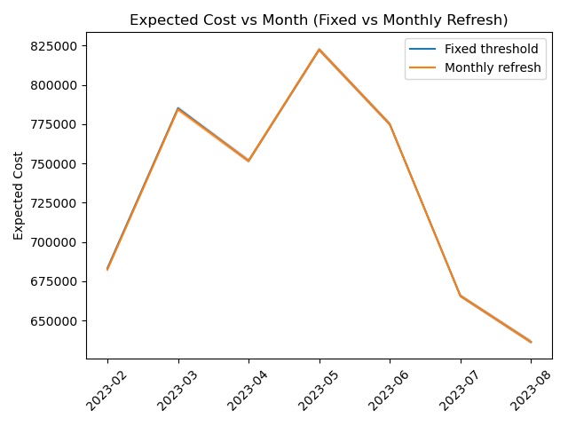
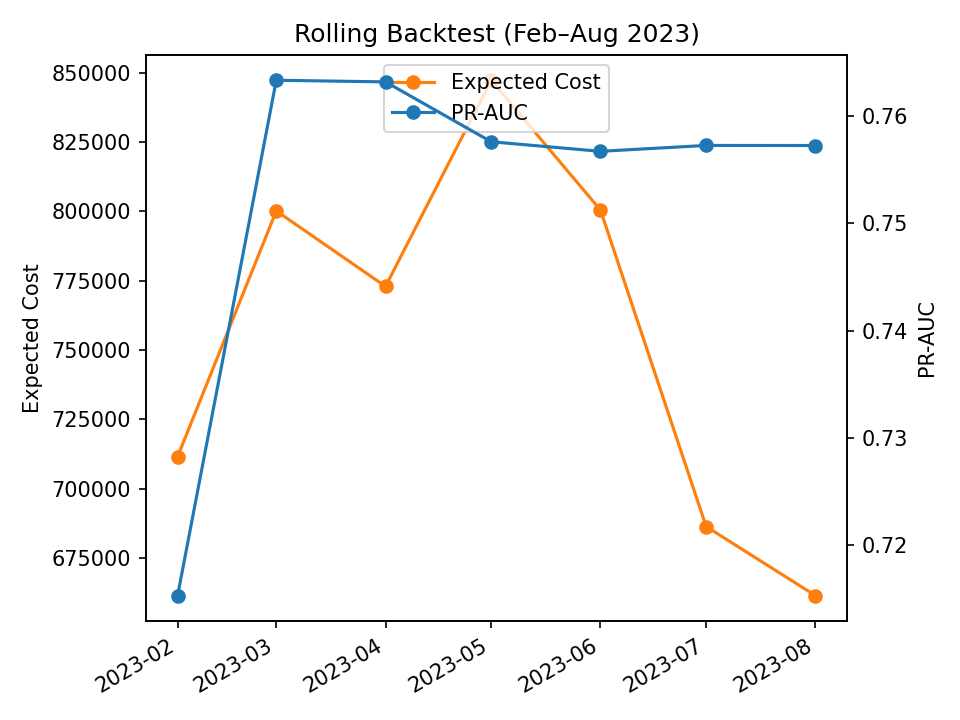
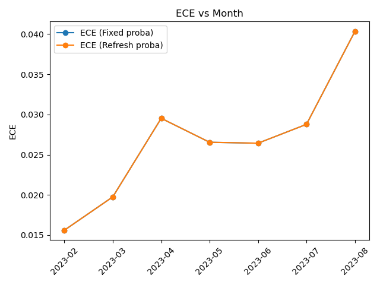

# Findings · NYC Taxi Time-Split Benchmark

## Key Numbers (XGBoost, Test, 3-seed mean±std)
- ROC-AUC: **0.7729 ± 0.0001**
- PR-AUC: **0.7623 ± 0.0001**
- Brier: **0.1624 ± 0.0000**
- Min Expected Cost: **47,240.67 ± 11.47** at threshold **0.30**
- Calibration (ECE): **0.003650161241743489** (95% CI: **[0.0025771415593510145, 0.005616172816252802]**)

## F1. Temporal stability under drift (rolling backtest)
- Rolling metrics indicate **gradual degradation from early months to test month (2023-08)**, consistent with temporal shift.
- Action: expanding-origin retraining maintains stability; consider monthly threshold refresh based on validation.

## F2. Cost-sensitive thresholding matters
- Validation-driven threshold search achieves **minimum expected cost at ~0.30**, materially better than naïve 0.5.
- Business-aligned cost curves support operating point selection; publish threshold + cost in reports.

## F3. Probability calibration helps decision quality
- ECE with 95% CI shows calibrated probabilities align better with observed rates, improving threshold transfer to test.
- When drift is stronger, recalibration per period reduces mis-calibrated over-confidence.

## F4. Ablation: feature-group contributions
- Feature-group ablations show certain groups dominate gains; drop tests prevent spurious improvements.
- Recommendation: monitor top groups for drift and reweigh or engineer alternatives if stability issues appear.

## Reproducibility & Audit
- Three seeds (42/43/44) → mean±std summary in `reports/summary/metrics_mean_std.json`.
- Artifacts: calibration / rolling / ablation figures are versioned in repo for quick review.

## Methodized Strategy (Fixed vs Monthly Refresh)
- **Methodized strategy:** Monthly recalibration + threshold refresh reduces expected cost by **27.00** on average across months (95% CI **[27.00, 27.00]**).

### Rolling Backtest (Feb–Aug 2023)

## Monthly Threshold Refresh vs Fixed
- **Methodized strategy (Fixed vs Monthly Refresh):** Average expected cost ↓ **231.71** across Feb–Aug 2023 (95% CI **[19.14, 483.57]**).

_Optional_: ECE by month

