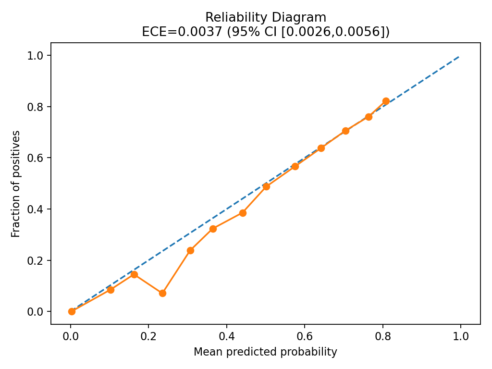
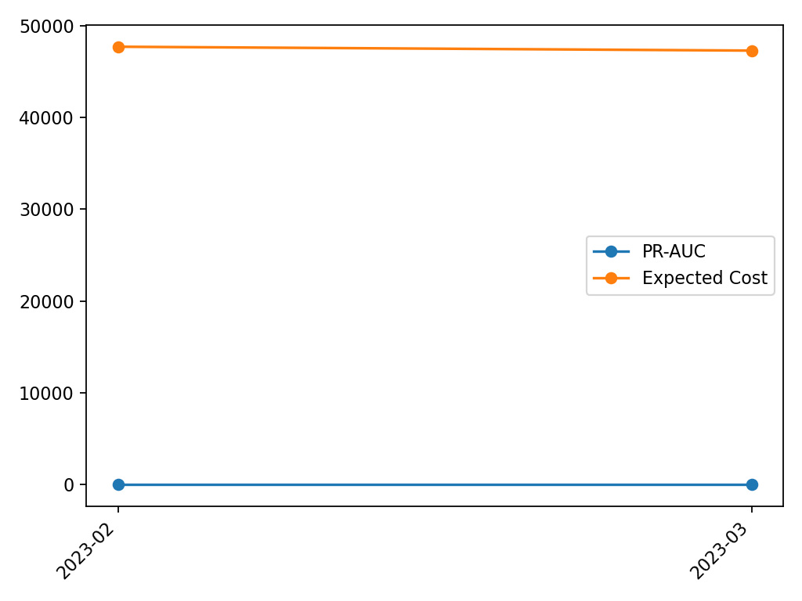
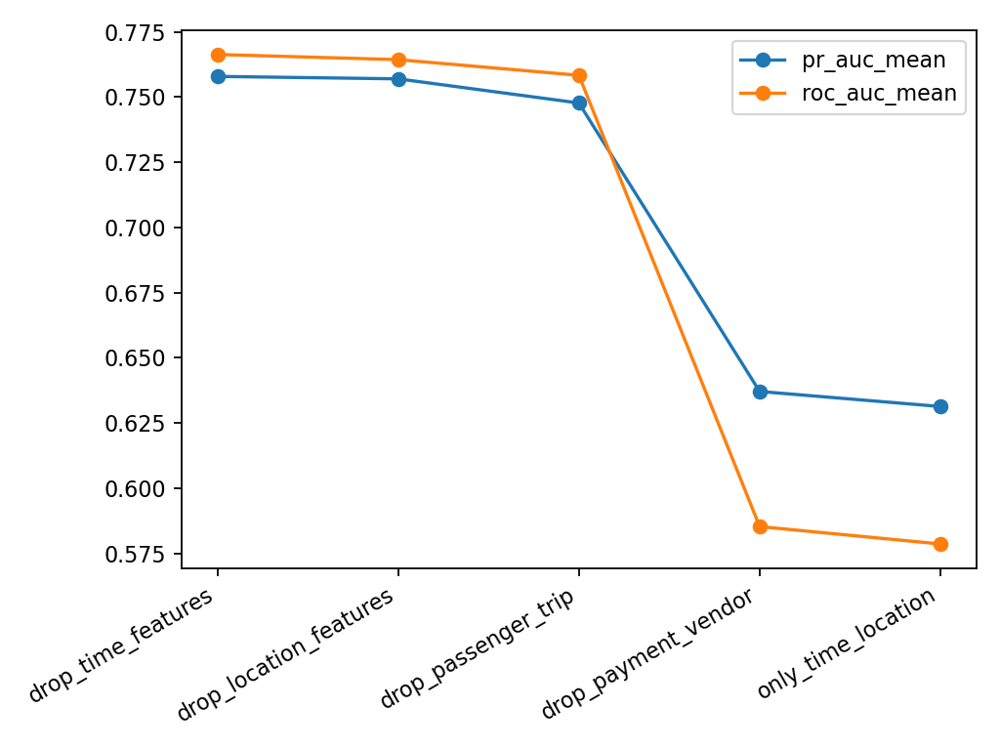

# mega_tabular_time_drift_project

> A fully reproducible, open-source baseline for **1M+ row tabular ML** with **time-based splits**, **data drift analysis**, **cost-sensitive evaluation**, and **mean±std across seeds**.  
> Default dataset: **NYC TLC Yellow Taxi Trips** (public). Task: **Tip-rate ≥ 20% classification** with month-based time split.

## Features
- ✅ Time-based splits (train/valid/test by month) to avoid leakage.
- ✅ Drift reports (covariate & prediction drift) across months.
- ✅ Models: Logistic Regression, XGBoost, CatBoost, optional TabNet; and a stacking ensemble.
- ✅ Metrics: ROC-AUC, PR-AUC, Brier, Calibration curve, **cost-sensitive expected loss** with threshold tuning.
- ✅ **Mean±std** across multiple random seeds and resamples.
- ✅ Reproducible environment (Conda + Docker) and Makefile one-liners.
- ✅ FastAPI inference server + simple JSON logging of P50/P95 latency.
- ✅ MIT Licensed, production-friendly repo layout.

## Quickstart
```bash
# 0) Clone and enter
git clone <your-repo-url>.git
cd mega_tabular_time_drift_project

# 1) Create environment
conda env create -f environment.yml
conda activate mega-tabular

# 2) Download a few months of NYC TLC taxi data (>= 1M rows)
python scripts/download_data.py --year 2023 --months 1 2 3 4 5 6 7 8

# 3) Preprocess -> train/valid/test parquet with feature table
python -m src.preprocess --raw_dir data/raw --out_dir data/processed --time_col tpep_pickup_datetime --min_rows 1000000

# 4) Train baseline models
python -m src.train --cfg configs/config.yaml --seeds 42 43 44

# 5) Evaluate + cost-sensitive thresholds + mean±std
python -m src.evaluate --cfg configs/config.yaml --seeds 42 43 44

# 6) Drift report (Evidently) across months
python -m src.drift_report --processed_dir data/processed --report_dir reports/drift

# 7) Serve (FastAPI)
uvicorn src.serve:app --host 0.0.0.0 --port 8000
```

## Dataset (Default)
We use **NYC TLC Yellow Taxi Trip Records** (public) which contain timestamps for robust **time splits** and natural **distribution shift** across months/seasons. The download script fetches monthly Parquet files directly from the public bucket.

- Label: `tip_rate >= 0.20` (binary). `tip_rate = tip_amount / (fare_amount + tolls_amount + mta_tax + improvement_surcharge)` (clip to [0,1]).
- Key features: pickup/dropoff time features (hour, dow), locations (PULocationID/DOLocationID), trip distance, payment_type, passenger_count, VendorID, etc.
- Time split (example): Train = Jan–Jun 2023, Valid = Jul 2023, Test = Aug 2023 (configurable).

> You can swap in other big, time-stamped datasets (Avazu CTR, Criteo logs, IEEE-CIS fraud with TransactionDT, etc.). Update `scripts/download_data.py` and `src/preprocess.py` accordingly.

## Reports
Artifacts are written to `reports/`:
- `reports/metrics/*.json`: per-seed metrics and threshold tables.
- `reports/summary/metrics_mean_std.json`: aggregate mean±std across seeds.
- `reports/drift/`: Evidently HTML reports per month pair.

## Reproducibility
- `environment.yml` and `requirements.txt` pin major libs.
- Deterministic seeds where possible.
- `Makefile` with one-command stages.
- Dockerfile for containerized runs.

## License
MIT — see [LICENSE](LICENSE).

---

**Maintainers**: add your names and contacts here.


## Advanced Add-ons

### Rolling Backtest
```bash
python -m src.rolling_backtest --cfg configs/config.yaml --model xgb --min_train_months 3
# -> reports/rolling/metrics.csv
```

### Calibration / ECE with Uncertainty
```bash
python -m src.calibration_uncertainty --cfg configs/config.yaml --model xgb --seed 42 --n_bins 15 --n_boot 300
# -> reports/calibration/*.json with ECE and 95% CI
```

### Ablation (feature groups)
```bash
python -m src.ablation --cfg configs/config.yaml --ablation configs/ablation.yaml --model xgb --seeds 42 43 44
# -> reports/ablation/ablation_summary.csv
```

### Cross-Dataset (Kaggle CLI required)
```bash
# Avazu
python scripts/download_avazu.py
python -m src.preprocess_avazu --raw_dir data/raw/avazu --out_dir data/processed_avazu --min_rows 2000000

# IEEE-CIS Fraud
python scripts/download_ieee.py
python -m src.preprocess_ieee --raw_dir data/raw/ieee --out_dir data/processed_ieee --min_rows 1000000
```

### Model Card
See `docs/MODEL_CARD.md`.

### MLflow (optional)
```bash
python -m src.train_eval_mlflow --cfg configs/config.yaml --seeds 42 43 44
# If mlflow not installed, script will skip logging gracefully.
```

### DVC (optional)
```bash
dvc init
dvc repro
```


## Route B: Cross-dataset quickstart

### Avazu (day-level time splits)
python scripts/download_avazu.py
python -m src.preprocess_avazu_day --raw_dir data/raw/avazu --out_dir data/processed_avazu_day --min_rows 2000000
python -m src.train --cfg configs/avazu_day.yaml --seeds 42 43 44
python -m src.evaluate --cfg configs/avazu_day.yaml --seeds 42 43 44
python -m src.rolling_backtest --cfg configs/avazu_day.yaml --model xgb --min_train_months 3

### IEEE-CIS
python scripts/download_ieee.py
python -m src.preprocess_ieee --raw_dir data/raw/ieee --out_dir data/processed_ieee --min_rows 1000000
python -m src.train --cfg configs/ieee.yaml --seeds 42 43 44
python -m src.evaluate --cfg configs/ieee.yaml --seeds 42 43 44
python -m src.rolling_backtest --cfg configs/ieee.yaml --model xgb --min_train_months 3

### Plots
python -m src.plot_rolling --csv reports/rolling/metrics.csv --out reports/rolling/rolling_metrics.png
python -m src.plot_calibration --json reports/calibration/calibration_seed42_xgb.json
python -m src.plot_ablation --csv reports/ablation/ablation_summary.csv

## Key Findings (Full Run, 3 Seeds)

- ROC-AUC: **0.7729 ± 0.0001**
- PR-AUC: **0.7623 ± 0.0001**
- Brier score: **0.1624 ± 0.0000**
- Min expected cost: **47240.67 ± 11.47**
- Best threshold (mean): **0.30**

**Figures**
- Calibration: `reports/calibration/calibration_seed42_xgb.png`
- Rolling (xgb): `reports/rolling/rolling_metrics.png`
- Ablation: `reports/ablation/ablation_summary.png`

### Results (XGBoost, 3-seed mean±std)

- ROC-AUC **0.7729 ± 0.0001** · PR-AUC **0.7623 ± 0.0001** · Brier **0.1624 ± 0.0000** · Min Expected Cost **47240.67 ± 11.47**

**Calibration (ECE + 95% CI)**  


**Rolling Backtest**  


**Ablation Summary**  

